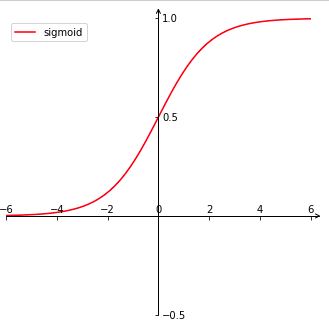
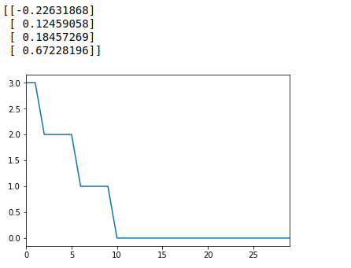

[TOC]

#### 什么是逻辑回归算法？

Logistic 回归是二分类任务的首选方法。它输出一个 0 到 1 之间的离散二值结果。简单来说，它的结果不是 1 就是 0。公式
$$
f(x) = \frac{1}{1+e^{-x}}
$$
数学常数 e 的真正含义，可以解释为什么是常数 e , 而不是 $\pi$ 之类的。

以下猜想：

什么是 e ? 简单说， **e 就是增长的极限**， 数值为 2.71828...

**在单位时间内，持续的翻倍增长所能达到的极限值**

这个值是自然增长的极限，因此以 e 为低的对数， 叫做自然对数。存在：

$$
e = \lim _{n \rightarrow \infty}(1+\frac{1}{n})^{n}
$$
摘自[维基百科]([https://zh.wikipedia.org/wiki/E_(%E6%95%B0%E5%AD%A6%E5%B8%B8%E6%95%B0)](https://zh.wikipedia.org/wiki/E_(数学常数)) 二项式定理证明

视 n 为存在的数值，所以用二项式定理可证明 e 为 2.71828...
$$
e  = \lim_{n\to\infty} \left(1+\frac{1}{n}\right)^n
\\ = \lim_{n\to\infty} \sum_{i=0}^{n}C_{i}^{n}1^{n-i}\left(\frac{1}{n}\right)^i
\\ \
\\ \ 
\\ =\lim_{n\to\infty} \left[C_{0}^{n}1^{n}\left(\frac{1}{n}\right)^0+C_{1}^{n}1^{n-1}\left(\frac{1}{n}\right)^1+C_{2}^{n}1^{n-2}\left(\frac{1}{n}\right)^2+C_{3}^{n}1^{n-3}\left(\frac{1}{n}\right)^3+...+C_{n}^{n}1^0\left(\frac{1}{n}\right)^n\right]
\\ \ 
\\ \ 
\\ =\lim_{n\to\infty} \left[1\times 1+n\times \frac{1}{n}+\frac{n!}{\left(n-2\right)!2!}\times \frac{1}{n^2}+\frac{n!}{\left(n-3\right)!3!}\times \frac{1}{n^3}+...+1\times \frac{1}{n^n}\right]
\\ \
\\ \
\\ =\lim_{n\to\infty} \left[1+1+\frac{n\times \left(n-1\right)}{2n^2}+\frac{n\times \left(n-1\right)\left(n-2\right)}{3\times 2n^3}+...+\frac{1}{n^n}\right]
\\ =2+\frac{1}{2}+\frac{1}{6}+...
\\ \
\\ \
\\ =2.71828...
$$


Python代码实现求 e：

```python
import math
def e(n):
    # factorial 阶乘
    return sum(1.0 / math.factorial(i) for i in range(n))

print(exp(100))
# 输出: 2.7182818284590455
```

e 是自然对数，逻辑回归的模型依赖自然对数，自然是 e , 而不是什么数了。范围 0 到 1之间。

还是说重点，什么是逻辑回归？

逻辑回归，英文: logistic regression  翻译成中文的译本却是有几个，逻辑回归（大家常说的），对数几率回归（周志华机器学习书籍），逻辑斯谛回归（Understanding Machine Learning：From Theory to Algorithms中译本）。

虽然名字有回归两字，但是它不是一个需要预测连续结果的回归算法

比如垃圾邮件，Logistic 回归算法输入，就是判断它是否是垃圾邮件（1）或者是正常邮件（0）

逻辑回归公式, logistic 函数，也是 sigmoid 函数：
$$
f(x) = \frac{1}{1+e^{-x}}
$$
可以看出主要是用来解决（0 / 1) 二分类的问题，延伸
$$
P(y=1 | x ; \theta)=f(x ; \theta)=\frac{1}{1+e^{-\theta^{T} x}}
$$
这里:

- $x;\theta$ 为输入的两个参数
- $\theta^{T} x=\theta_{0}+\theta_{1} x_{1}+\theta_{2} x_{2}+\theta_{3} x_{3}+\dots$
- $\theta=\left[\theta_{0}, \theta_{1}, \theta_{2}, \theta_{3}, \ldots\right]$
- $x=\left[1, x_{1}, x_{2}, x_{3}, \ldots\right]$
- 当 $P(y=1|x)$ 的值大于 0.5 ， 输出 1， 否则输出 0



#### 可视化曲线python 代码

```python
import math
import matplotlib.pyplot as plt
import numpy as np
import mpl_toolkits.axisartist as axisartist

# 原函数
def sigmoid(input_x):
    return 1.0 / (1.0 + np.exp(-input_x))

# 画图
def Axis(fig, ax):
    #将绘图区对象添加到画布中
    fig.add_axes(ax)
    # 隐藏坐标抽
    ax.axis[:].set_visible(False)
    # new_floating_axis 创建新的坐标
    ax.axis["x"] = ax.new_floating_axis(0, 0)
    # 给 x 轴创建箭头线，大小为1.0
    ax.axis["x"].set_axisline_style("->", size = 1.0)
    # 给 x 轴箭头指向方向
    ax.axis["x"].set_axis_direction("top")
    # 同理，创建 y 轴
    ax.axis["y"] = ax.new_floating_axis(1, 0)
    ax.axis["y"].set_axisline_style("->", size = 1.0)
    ax.axis["y"].set_axis_direction("right")
    
# 返回间隔均匀的100个样本，计算间隔为[start, stop]。
x = np.linspace(-10, 10, 100)
y = [sigmoid(x[i]) for i in range(len(x))]

#创建画布
fig = plt.figure(figsize=(12, 12))
 
#创建绘图对象ax
ax = axisartist.Subplot(fig, 222)
Axis(fig, ax)
 
# 设置x, y轴范围
plt.ylim((-0.5, 1))
plt.xlim((-6, 6))
plt.yticks((-0.5, 1, 0.5))
plt.plot(x, y, color='red', label='sigmoid')
plt.legend()

plt.show()
```


#### 最大似然估计

你可以使用不同的方法（如优化算法）来最大化概率。牛顿法也是其中一种，可用于查找许多不同函数的最大值（或最小值），包括似然函数。也可以用梯度下降法代替牛顿法。这里描述使用梯度下降法

推导求参数  $\theta$ 

- 类别 1 的概率   
  $$
  P =\frac{1}{1+e^{-\theta^{T} x}}
  $$
  
- 类别 0 的概率 
  $$
  1-P=\frac{1+e^{-\theta^{T} x}-1}{1+e^{-\theta^{T} x}}=\frac{1}{1+e^{\theta^{T} x}}
  $$

- 类别 1 与 类别 0 的概率  
  $$
  \frac{P}{1-P}=e^{\theta^{T} x}
  $$

- 类别 1 与 类别 0 概率比值的自然对数
  $$
  \ln \frac{P}{1-P}=\theta^{T} x
  $$
  

可以看到等式右边是线性回归模型的函数$y = w^Tx + b$ , (求导过程不会保留常数b), logistic regresssion 就是用线性预测结果去逼近真实标记的对数几率。

- 等式转换
  $$
  \ln \frac{p(y=1 | x;\theta )}{p(y=0 | x;\theta)}=\theta^{T} x
  $$


$$
\begin{aligned} p(y=1 | x;\theta) &=\frac{e^{\theta^{T} x}}{1+e^{\theta^{T} x}} =
P =\frac{1}{1+e^{-\theta^{T} x}}
\\ \ 
\\ p(y=0 | x; \theta) &=\frac{1}{1+e^{\theta^{T} x}} \end{aligned}
$$
**ln 是log 底数为 e 的简写**。

现在可以用 “极大似然法” 估计 $\theta$ 的值，极大似然估计的目的就是：利用已知的样本结果，反推最大概率（最有可能）导致这样结果的参数值。

类别 1 的概率为 P, 则类别为 0 概率为 1 - P , 的得到概率为
$$
p(y_i) = P^{y^{(i)}} * (1-P)^{1 - y^{(i)}}
$$
这样可得到极大似然函数
$$
L(\theta)=\prod_{i \in\{1, \ldots, N\}} P^{y^{(i)}} * (1-P)^{1-y^{(i)}}
$$
取自然对数
$$
L(\theta) = \sum_{i=1}^{N}\bigg ( y^{(i)}\times lnP + (1-y^{(i)}) \times ln(1-P) \bigg)
$$


#### 梯度下降法

似然函数，可化简：
$$
L(\theta) = \sum_{i=1}^{N}\bigg ( y^{(i)}\times lnP + (1-y^{(i)}) \times ln(1-P) \bigg)
\\ \ 
\\ \
= \sum_{i=1}^{N}\bigg ( y^{(i)}(lnP - ln(1-P)) + ln(1-P)    \bigg)
\\ \
\\ \
= \sum_{i=1}^{N}\bigg ( y^{(i)}ln\frac{P}{1-P} + ln(1-P) \bigg )
$$
由上面类别的概率
$$
\ln \frac{P}{1-P}=\theta^{T} x
\ \ \ \ \ \ , \ \ \ \ 1-P=\frac{1}{1+e^{\theta^{T} x}}
$$
继续化简：
$$
L(\theta) = \sum_{i=1}^{N} \bigg ( y^{(i)}\times (\theta x) + ln\frac{1}{1+e^{\theta^{T} x}}\bigg)
\\ \
= \sum_{i=1}^{N} \bigg ( y^{(i)}\times (\theta x) + ln(({1+e^{\theta^{T} x}})^{-1})\bigg)
\\ \
= \sum_{i=1}^{N} \bigg ( y^{(i)}\times (\theta x) - ln({1+e^{\theta^{T} x}})\bigg)
$$

负梯度，求得最小值，即最小损失值
$$
J(\theta) = -L(\theta) = -\sum_{i=1}^{N} \bigg ( y^{(i)}\times (\theta x) - ln({1+e^{\theta^{T} x}})\bigg)
$$
对 $\theta$ 求导：
$$
\frac{dJ}{d\theta} = - \sum_{i=1}^{N}\bigg( y^{(i)} \times x - \frac{1}{1+e^{\theta^Tx}} \times e^{\theta ^Tx}\times x \bigg)
$$
由上面的式子：
$$
\begin{aligned} p(y=1 | x;\theta) &=\frac{e^{\theta^{T} x}}{1+e^{\theta^{T} x}} =
 \frac{1}{1+e^{-\theta^{T} x}}=P \end{aligned}
$$
最后可化简得
$$
\nabla_{\theta} J(\theta) = \frac{dJ}{d\theta} = -\sum_{i=1}^{N}x(y^{(i)}-P)
$$
梯度下降更新权值：
$$
\theta_{new} = \theta_{old} - \alpha \nabla_{\theta} J(\theta) \\ \ = \theta_{old} - \alpha\sum_{i}x^{(i)}(f(x^{(i)};\theta)-y^{(i)})
$$
这里:

- $\theta_{old}$ 为权值旧的值

- $f(x^{(i)}; \theta)$ 为预测类别 1 的概率
- $\alpha $ 为学习率
- $y^{(i)}$  已知类别的值
- $x^{(i)}$  特征的值


#### Python代码简单实现（批量梯度下降法）

```python

import numpy as np

# sigmoid 函数
def sigmoid(input_x):
    return 1.0 / (1.0 + np.exp(-input_x))

# 损失函数 
def loss(P, y):
    return (P - y)

# 更新权值
def update_theta(alpha, X, error, theta):
    grad = np.dot(X.T, error)
    theta -= alpha * grad
    return theta
    
# 保存记录目标函数的值，以便观察是否越接近损失 0
def save_cost(P, y, N):
    j = -np.sum(y * np.log(P) + (1 - y) * np.log(1 - P))
    return (1 / N) * j
```

测试是否 $\theta$ 已经是最优：

```python
from sklearn import datasets
import pandas as pd
import numpy as np
from matplotlib import pyplot as plt
from numpy.linalg import inv

iris = datasets.load_iris()
X = iris.data[:100, :]
y = iris.target[:100].reshape((100, -1))

N, M = X.shape
# 学习率
alpha =  0.0003
# 参数矩阵
theta = np.random.random((n, 1))
# 循环
maxLoop = 30
# 创建Series
J = pd.Series(np.arange(maxLoop))

for i in range(maxLoop):
    # sigmoid 预测函数
    P = sigmoid(np.dot(X, theta)) 
    # 损失
    error = loss(P, y)
    # 保存目标函数的值
    J[i] = save_cost(P, y, N)
    # 更新权值
    theta = update_theta(alpha, X, error, theta)
print(theta)
J.plot()
plt.show()
```




#### 优缺点

优点：

1. 简单实现，模型的可解释性很好。
2. 训练速度快。计算的量只和特征的数目有关，不需要缩放输入特征等等。
3. 资源占用小。因为只需要存储各个维度的特征值。

缺点：

1. 准确率不是很高，就是因为模型（非常类似线性模型），很难拟合数据的真实分布，容易导致过拟合。
2. 难处理数据不平衡的问题。
3. 逻辑回归本身无法解决非线性问题，因为它的决策边界是线性的。
4. 高度依赖正确的数据表示。


#### 什么时候用

当 Y 变量只有两个值时，当你面临分类问题时，可以考虑使用逻辑回归。逻辑回归也用于多分类别分类。


#### 多分类

有很多种多分类算法，如随机森林分类器或者朴素贝叶斯分类器等等。逻辑回归也可以用于多分类任务。可以通过一些技巧，分两种策略。

1. 一对多策略

   基本思想是将第 i 种类型的所有样本作为正例，将剩下的所有样本作为负例。进行训练得出一个分类器。这样，我们就得到 N 个分类器。预测的时候，将样本给 N个分类器，获得 N 个结果，选择其中**概率值最大**的那个作为结果。

2. 一对一策略

   这种策略，假设有 N 个类别，不同的类别之间，训练一个分类器，训练得到的结果有 $C_{N}^{2}$ 种不同的分类器。

   预测的时候，将样本给所有的分类器，会有 $N(N-1) 个结果$， 最终结果通过**"投票"**产生。


#### 应用场景

- 垃圾邮件分类，垃圾（1）， 正常邮件（0）
- 广告点击预测，点击（1）， 不点击（0）
- 医疗效果预测，比如是否患癌症（1），或没有患癌症（0）


#### 总结

在这里可以了解常数 e 的基本含义，可视化逻辑回归曲线图实现，逻辑回归推导实现。了解了似然函数，梯度下降法推理参数过程。


参考资料

<https://github.com/GreedyAIAcademy/Machine-Learning/tree/master/3.LinearRegression.LogisticRegression>

<https://juejin.im/post/5a9507196fb9a06351729cd5>

<https://www.cnblogs.com/ModifyRong/p/7739955.html>

<https://blog.csdn.net/zengxiantao1994/article/details/72787849>

