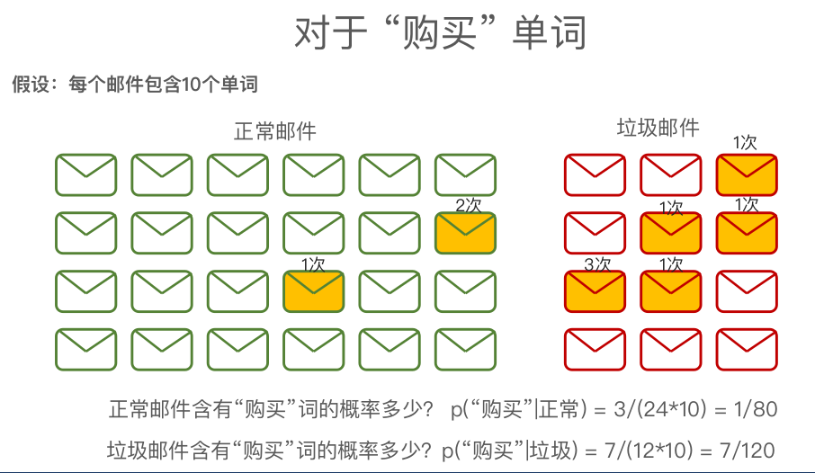

朴素贝叶斯

p(A|B) 表示在事件 B 已经发生的前提下，事件 A发生的概率：
$$
p(A|B) = \frac{p(AB)}{p(B)}
$$
但一般我们更想知道 p(B|A)的概率

贝叶斯定理：
$$
p(B|A) = \frac{p(A|B) \times p(B)}{p(A)}
$$

举例说明:

正常/垃圾 邮件概率

p(正常) = $ \frac{24}{24+12} = \frac{2}{3}$

p(垃圾) =  $\frac{12}{24+12} = \frac{1}{3}$

在正常邮件中，购买出现 3 次, 总共 24封邮件，每封邮件包含 10 个单词

p(“购买”|正常) = $\frac{3}{24\times 10} = \frac{1}{80}$

在垃圾邮件中，购买出现了 7次，总共12 封邮件， 

p("购买"|垃圾) = $\frac{7}{12 \times 10} = \frac{7}{120}$

通过这种方式，依次类推，可以统计得到以下的情况。。

正常：

p(“购买”|正常) = $\frac{1}{80}$

p("物品"|正常) = $\frac{1}{60}$

p("不是"|正常) = $\frac{1}{60}$

p("广告"|正常) = $\frac{1}{48}$

垃圾邮件单词概率

p(“购买”|垃圾) = $\frac{7}{120}$

p("物品"|垃圾) = $\frac{1}{30}$

p("不是"|垃圾) = $\frac{1}{40}$

p("广告"|垃圾) = $\frac{1}{30}$

对于邮件内容有**“购买物品，不是广告”**判断是否是垃圾邮件

问题:    p(正常|邮件内容)? 、 p(垃圾|邮件内容) ？

贝叶斯定理:
$$
p(x|y)  = \frac{p(y|x)\times p(x)}{p(y)}
$$
正常邮件
$$
p(正常|邮件内容) = \frac{p(邮件内容|正常)\times p(正常)}{p(邮件内容)}
$$

对于邮件内容有**“购买物品，不是广告”**判断是否是垃圾邮件
$$
p(正常|邮件内容) = \frac{p(邮件内容|正常)\times p(正常)}{p(邮件内容)}
$$

$$
= \frac{p("购买"|正常) \times p("物品"|正常) \times p("不是"|正常) \times p("广告"|正常) \times p(正常)}{p(邮件内容)} \ \ \ \ \ (1)
$$

$$
p(垃圾|邮件内容) = \frac{p(邮件内容|垃圾)  \times p(垃圾)}{p(邮件内容)}
$$

$$
= \frac{p("购买"|垃圾) \times p("物品"|垃圾) \times p("不是"|垃圾) \times p("广告"|垃圾) \times p(垃圾)}{p(邮件内容)} \ \ \ \ \ (2)
$$

对于p("购买"|正常) 、p("物品" | 正常）等概率，上面已统计求出概率值。

不必求出p(邮件内容）的概率，只需比较分子大小 : **（1）<  (2)  ? 是 ：垃圾邮件，否 ：正常邮件。**

