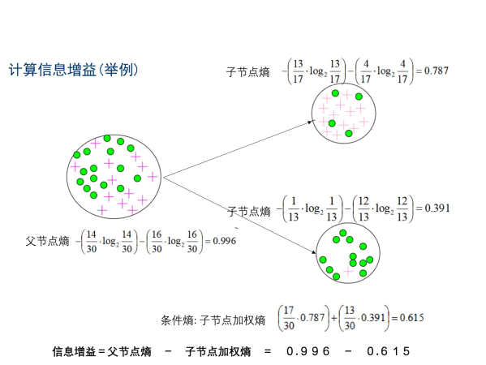

## 信息熵

用来衡量信息不确定的指标。不确定性是一个事件出现不同结果的可能性。

熵值低，某个确定性概率会偏高。

熵的计算公式：
$$
H(X) = - \sum_{i=1}^{n} P(X = i)log_2 P(X = i)
$$
其中： $P(X = i)$ 为随机变量 X 取值为 i 的概率

举例：

硬币 

正面： 0.5 

反面： 0.5 
$$
Entropy = -0.5 \times  log0.5 - 0.5 \times log0.5 = 1
$$
正面 : 0.9

反面: 0.01
$$
Entropy = -0.99 \times log0.99 -0.01 \times log0.01 = 0.08
$$

## 条件熵

通过更多的信息，条件，来减小不确定性，知道的信息，条件越多，信息的不确定性越小。
$$
H(X | Y)=\sum_{v \in \text {values}(Y)} P(Y=v) H(X | Y=v)
\\ 
\\ \
\\ 如何求 \ \ H(X|Y=v) ?
\\ 
\\ \
H(X | Y=v)=-\sum_{i=1}^{n} P(X=i | Y=v) \log _{2} P(X=i | Y=v)
$$


## 信息增益

$$
I(X, Y)=H(X)-H(X | Y)=H(Y)-H(Y | X)
$$

$$
H(X)=-\sum_{i=1}^{n} P(X=i) \log _{2} P(X=i)
$$

$$
H(X | Y)=\sum_{v \in v a l u e s(Y)} P(Y=v) H(X | Y=v)
$$

$$
H(X | Y=v)=-\sum_{i=1}^{n} P(X=i | Y=v) \log _{2} P(X=i | Y=v)
$$

举例信息增益：




决策树

优点：

- 可解释性高
- 能处理非线性的数据
- 不需要数据归一化
- 可以用于特征工程，特征选择
- 对数据没有偏好
- 广泛使用
- 容易实现
- 可以转化为规则

缺点：

- 启发式生成，不是最优解
- 容易过拟合
- 微小的数据改变会改变整个树的形状
- 对类别不平衡的数据不友好


随机森林

同时训练多个决策树，随机，从原来的数据集随机（要放回） 取一个子集作为森林中某一个决策树的训练集，选择分叉的特征时，限定为随机选择的子集寻找一个特征

优点：

- 消除了决策树容易过拟合的缺点
- 提供一个实验方法，可以去侦测variable interactions。


```python
import numpy as np
importances = dtree.feature_importances_
feat_names = df.drop(['label'],axis=1).columns

indices = np.argsort(importances)[::-1]
plt.figure(figsize=(12,6))
plt.title("Feature importances by DecisionTreeClassifier")
plt.bar(range(len(indices)), importances[indices], color='lightblue',  align="center")
plt.step(range(len(indices)), np.cumsum(importances[indices]), where='mid', label='Cumulative')
plt.xticks(range(len(indices)), feat_names[indices], rotation='vertical',fontsize=14)
plt.xlim([-1, len(indices)])
plt.show()
```

